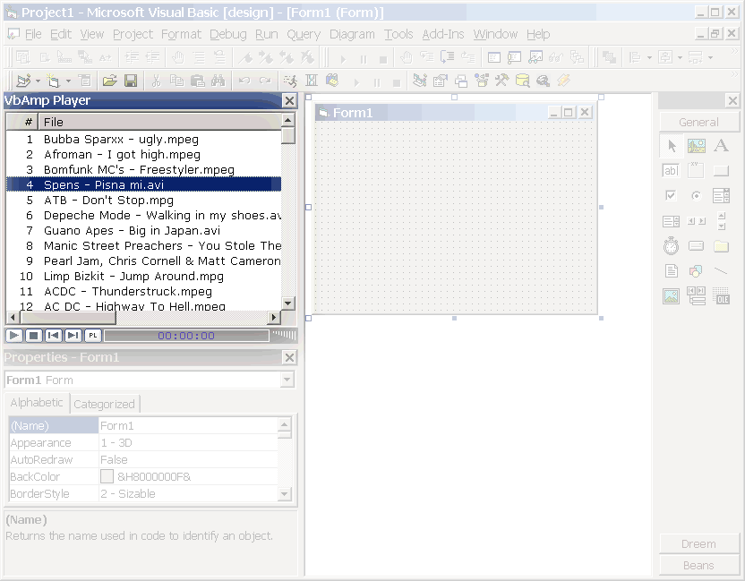



## VbAmp Player

### Description

This is a general purpose media player implemented as a VB Add-in which is "directly" using DirectShow interfaces. Capable of playing avi/mpeg-1/mpeg-2 videos and wav/mp3 audio files. You'll need the codecs of course :-)) http://www.divx.com and http://www.elecard.com are couple of addresses to start. VbAmp Player supports BSPlayer playlist files, drag and drop of files from explorer. Please report bugs and problems and don't forget to leave your votes! P.S. also, check out the new version 1.2 of Outlook Bar control at http://www.planet-source-code.com/vb/scripts/ShowCode.asp?txtCodeId=36529&lngWId=1 - everyone consider yourself notified :-))
 
### More Info
 

             |
---                |---
**Submitted On**   |2002-08-09 22:24:52
**By**             |[Vlad Vissoultchev](https://github.com/Planet-Source-Code/PSCIndex/blob/master/ByAuthor/vlad-vissoultchev.md)
**Level**          |Intermediate
**User Rating**    |4.6 (41 globes from 9 users)
**Compatibility**  |VB 6\.0
**Category**       |[Complete Applications](https://github.com/Planet-Source-Code/PSCIndex/blob/master/ByCategory/complete-applications__1-27.md)
**World**          |[Visual Basic](https://github.com/Planet-Source-Code/PSCIndex/blob/master/ByWorld/visual-basic.md)
**Archive File**   |[VbAmp\_Play116342892002\.zip](https://github.com/Planet-Source-Code/vlad-vissoultchev-vbamp-player__1-37779/archive/master.zip)

